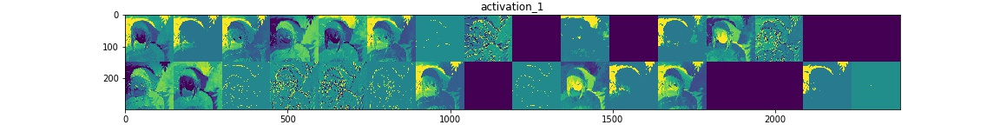
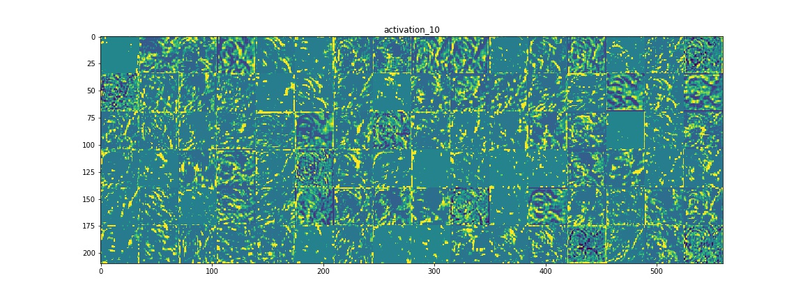
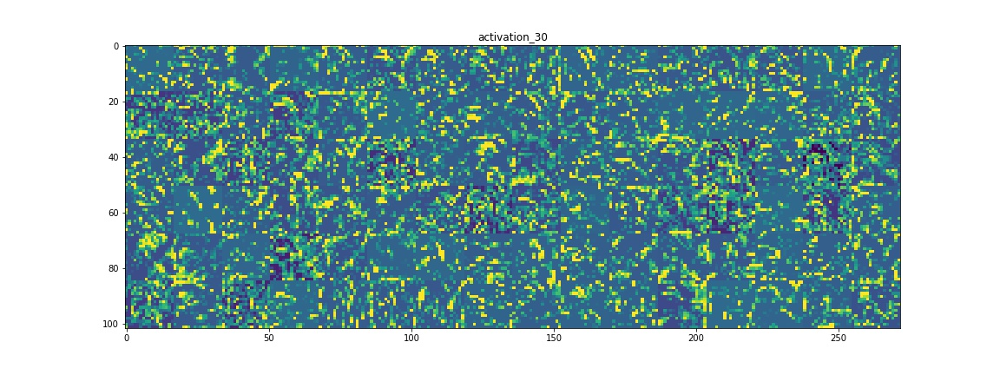
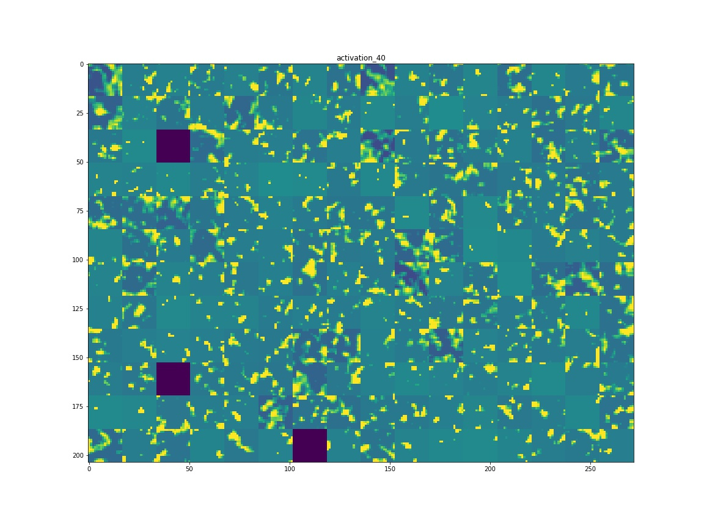
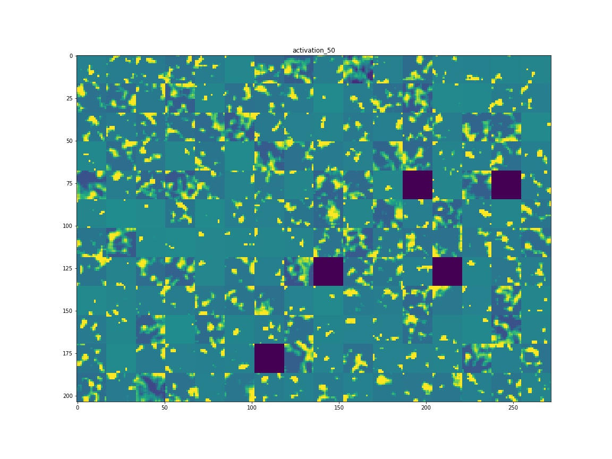
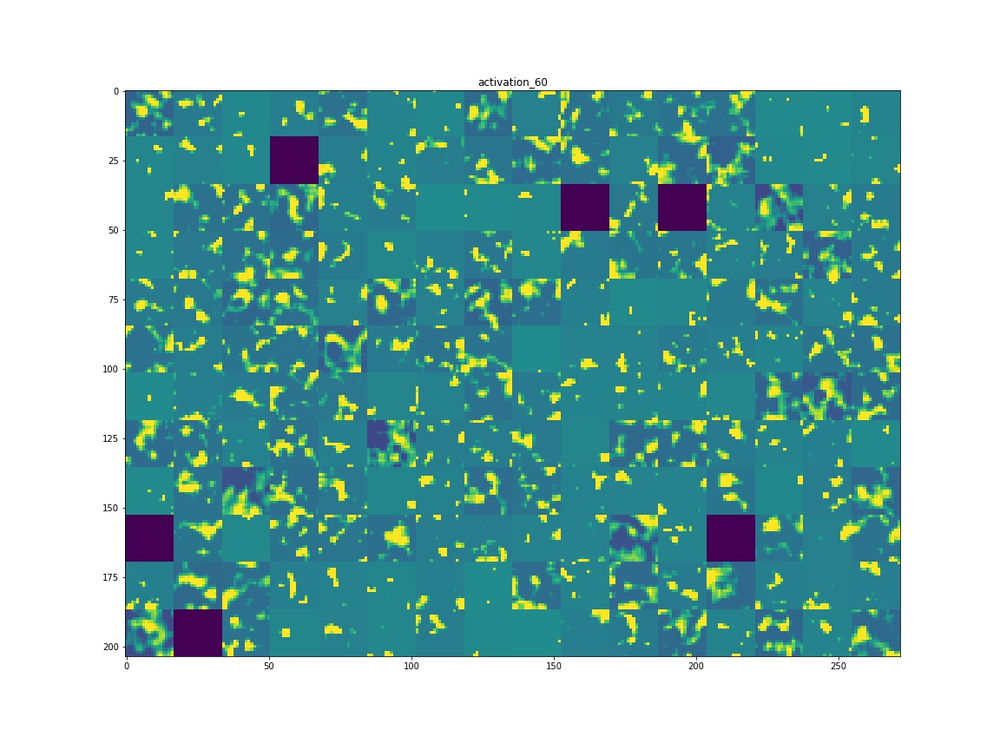
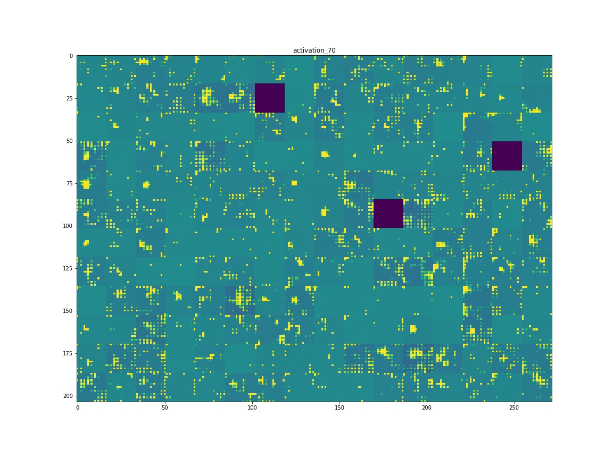
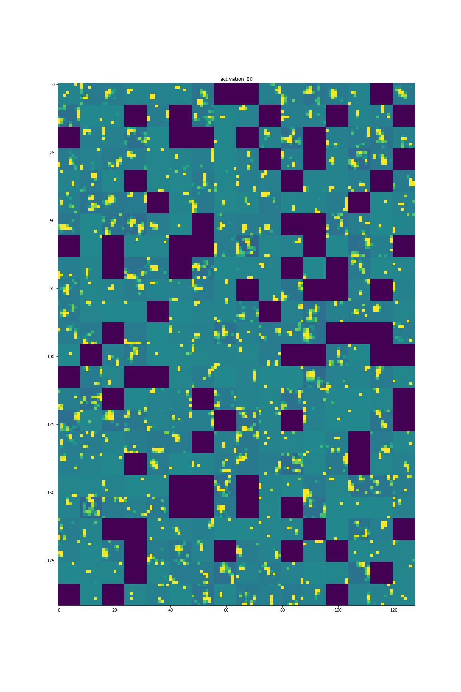
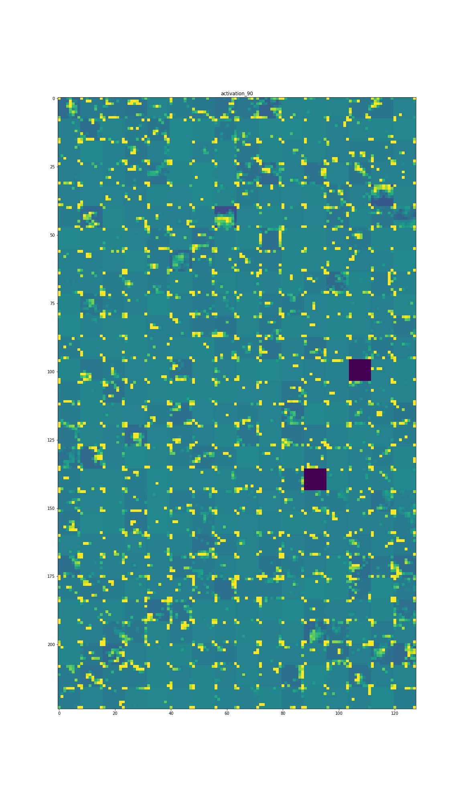
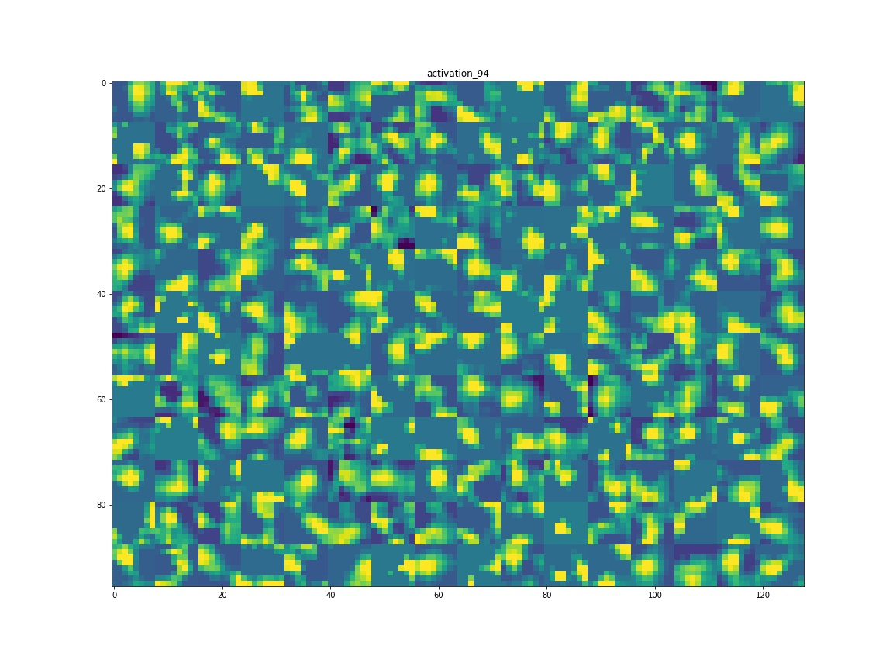

# cnn-inside
2018-11-26
# 卷积网络内究竟发生了什么
## 权重下载地址 https://github.com/fchollet/deep-learning-models/releases/download/v0.5/inception_v3_weights_tf_dim_ordering_tf_kernels.h5
## https://github.com/fchollet/deep-learning-models/releases/download/v0.5/inception_v3_weights_tf_dim_ordering_tf_kernels_notop.h5

# 原始图像：

# 卷积内通道图像：

